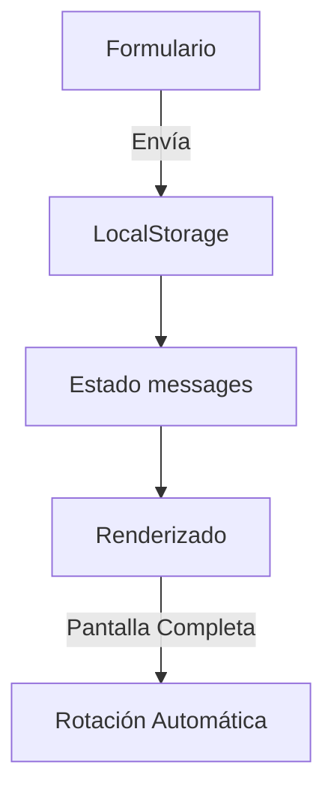
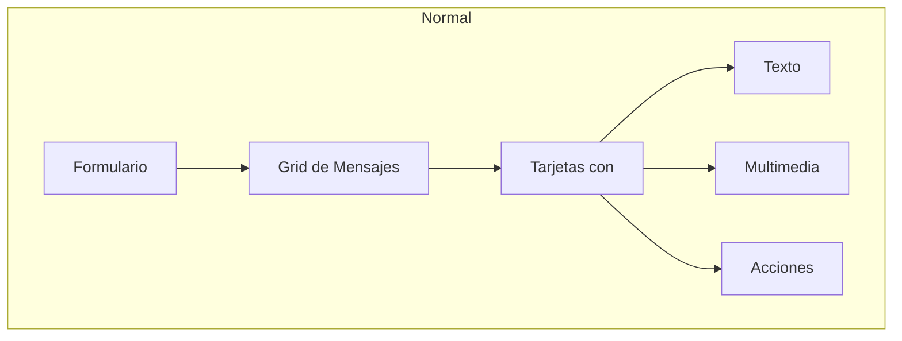
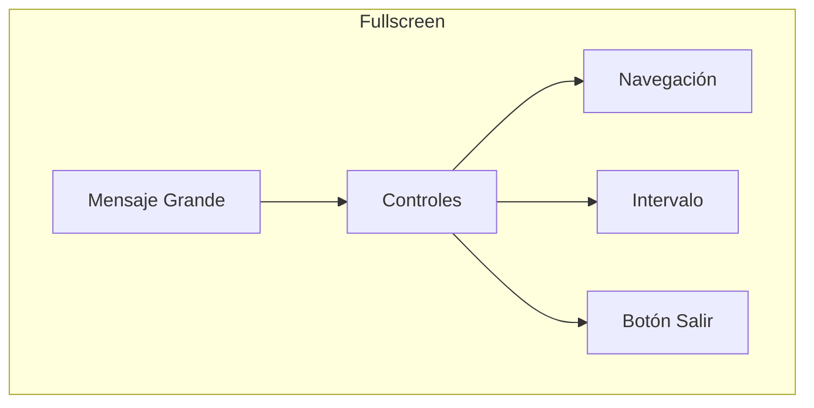

# Documentación del Componente `LinkWebMensajesNovios`

## 📌 Visión General
Componente React para un libro de visitas/mensajes digital para bodas, que permite:
- Enviar mensajes con texto y multimedia
- Visualizar mensajes en modo normal o pantalla completa
- Administrar mensajes (editar/eliminar)
- Rotación automática en pantalla completa

## 🛠 Tecnologías Utilizadas
- React (Hooks: useState, useEffect, useRef)
- LocalStorage (persistencia de datos)
- SCSS (estilos)
- Iconos de [react-feather](https://feathericons.com/)

## 🗂 Estructura del Componente

### 1. Estados Principales
```javascript
const [messages, setMessages] = useState([]) // Almacena todos los mensajes
const [isFullscreen, setIsFullscreen] = useState(false) // Controla modo pantalla completa
const [rotationInterval, setRotationInterval] = useState(10000) // Tiempo entre rotación (10s)
```

### 2. Flujo de Datos


### 3. Funciones Clave

#### 🖊 Manejo de Mensajes
- `handleSubmit`: Valida y guarda nuevos mensajes
- `handleDelete`: Elimina mensajes por ID
- `handleEdit`: Prepara formulario para edición

#### 🖼 Multimedia
- `handleMediaChange`: Valida y muestra vista previa de imágenes/videos
- `removeMedia`: Limpia archivos seleccionados

#### 🖥 Pantalla Completa
- Sistema de rotación automática configurable
- Navegación manual entre mensajes

## 🔄 Conexiones Principales

### Con LocalStorage
```javascript
useEffect(() => {
  // Carga mensajes al iniciar
  const savedMessages = localStorage.getItem("weddingMessages")
  if (savedMessages) setMessages(JSON.parse(savedMessages))
}, [])

useEffect(() => {
  // Guarda mensajes cuando cambian
  localStorage.setItem("weddingMessages", JSON.stringify(messages))
}, [messages])
```

### Sistema de Rotación
```javascript
useEffect(() => {
  if (isFullscreen) {
    const interval = setInterval(() => {
      setCurrentIndex(prev => (prev + 1) % messages.length)
    }, rotationInterval)
    return () => clearInterval(interval)
  }
}, [isFullscreen, messages.length, rotationInterval])
```

## 🎨 Estructura Visual

### Modo Normal


### Modo Pantalla Completa


## 📱 Responsive Design
- **Mobile First**: Estilos base para móviles
- **Breakpoints**:
  - Tablet: 768px
  - Desktop: 1024px
- Ajustes progresivos de:
  - Tamaños de fuente
  - Espaciados
  - Disposición de elementos

## 🛡 Validaciones
- Límite de caracteres (200 para mensajes)
- Tamaño máximo de archivos:
  - Imágenes: 2MB
  - Videos: 5MB
- Validación de campos requeridos

## 📂 Estructura de Archivos
```
components/
└── LinkWebMensajesNovios/
    ├── index.js         # Componente principal
    └── styles.scss      # Estilos específicos
```

## 🎯 Propósito del Componente
Creado para:
1. Permitir a invitados dejar mensajes en una boda digital
2. Mostrar mensajes en pantalla completa durante el evento
3. Administrar fácilmente los mensajes recibidos
4. Funcionar sin necesidad de backend (solo frontend + localStorage)

## ⚙️ Configuración Importante
```javascript
// En el código:
const [rotationInterval, setRotationInterval] = useState(10000) // 10 segundos

// Opciones disponibles:
// 5000 → 5 segundos
// 10000 → 10 segundos
// 15000 → 15 segundos
// 20000 → 20 segundos
// 30000 → 30 segundos
```

## 📝 Notas de Uso
1. Los mensajes se guardan automáticamente
2. Límite de 50 mensajes almacenados
3. Modo pantalla completa ideal para proyectar
4. Diseño adaptable a diferentes pantallas

## 🐛 Manejo de Errores
- Alerta cuando se excede el límite de almacenamiento
- Validación visual de campos obligatorios
- Mensajes de error para archivos muy grandes

# msjspantallaeventos
